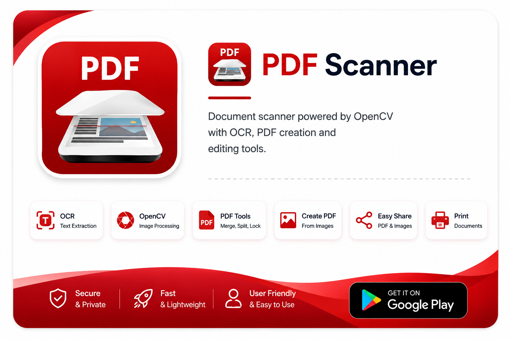
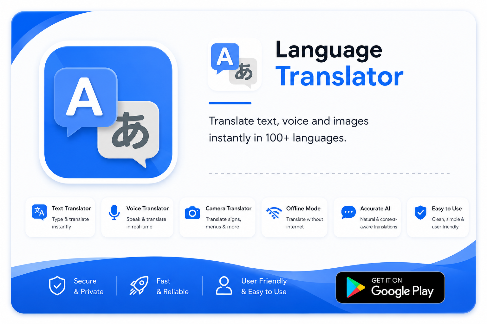
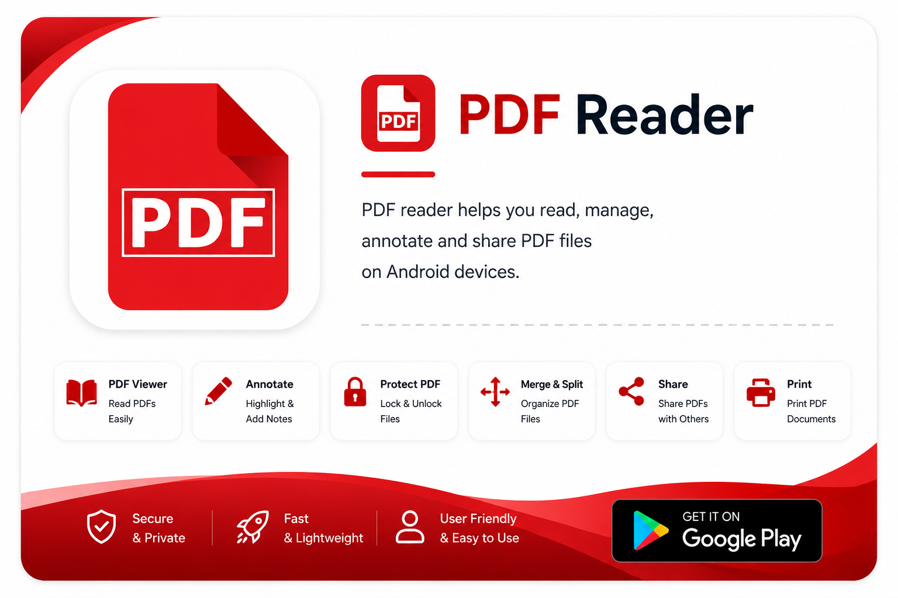

<h1 align="center">Hi 👋, I'm Sajid Ali</h1>

<h3 align="center">
Software Engineer • Android • Kotlin • Java • Jetpack Compose
</h3>

Building scalable Android applications with Kotlin, Java, and Jetpack Compose. 
Contributed to fintech and utility products with <strong>50M+ downloads</strong>.

---

# 👨‍💻 About Me

- 💼 Software Engineer at a **Sweden Based Fintech Company**
- 📱 6+ years of experience building Android applications
- 🚀 Specialized in building modern, scalable Android applications with Kotlin and Java
- 📊 Contributed to Android applications with **50M+ downloads**
- 🤝 Passionate about Open Source, collaboration, and building impactful mobile products

---

# 💻 Tech Stack

---

# 🚀 Featured Apps

---

# 🔥 GitHub Streak

---

# 🌐 Connect With Me

---

⭐ Thanks for visiting my profile! 

